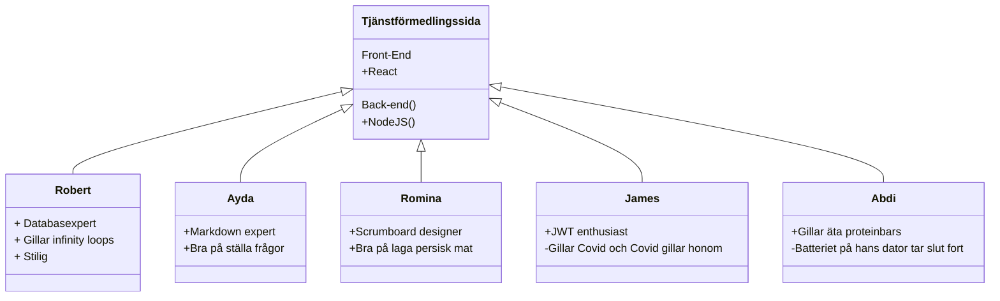

# Vårt projekt:
Vårt projekt är en tjänstförmedlingssida. Man ska som tjänstutövare kunna skapa en profil för att lägga upp sina tjänster.
Som köpare kan man söka på tjänster och kontakta tjänsteutövarna genom att skicka kontaktförfrågningar.

## Onboarding
Det här vår [Trello sprintboard](https://trello.com/b/bv0EIPpR/tj%C3%A4nstf%C3%B6rmedlingssida)

    # The coding languages we use:
    React
    Jest for testing

    # Instructions
    We recommend Visual studio code as an editor
    npm start
    Clone repo
    Run NPM i to install all current module packages

<h3>Class Diagram over project developers<h3>

