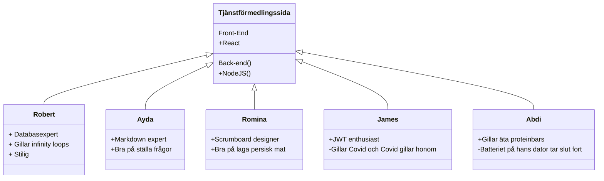

# Vårt projekt:
Vårt projekt är en tjänstförmedlingssida. Man ska som tjänstutövare kunna skapa en profil för att lägga upp sina tjänster.
Som köpare kan man söka på tjänster och kontakta tjänsteutövarna genom att skicka kontaktförfrågningar.

| # Our   |      # Weekly      |  # Plans |
|----------|-------------|------|
| Dag |  Tid | Plats |
| Måndag |    10.00   |   Stan |
| Tisdag |    09.00   |   Skolan |
| Onsdag |    10.00   |   Online/discord |
| Torsdag |   09.00   |   Skolan |
| Fredag |    13.00   |   Online |


## Onboarding
Det här vår [Trello sprintboard](https://trello.com/b/bv0EIPpR/tj%C3%A4nstf%C3%B6rmedlingssida)
### Hosting
the page is hosted at heroku follow this link https://tjanster22.herokuapp.com/

**FrontEnd language:**
+ React

**Test technologies:**
+ Jestjs with React testing library
    
 <h3>Class Diagram over project developers<h3>





## TTFHW

To access the repository, make sure you are a collaborator, so that you can clone the repo in your workspace folder with this command:

```javascript
git clone: https://github.com/Tootfarangi90/Tjanstformedlingssida-BE.git
```

How to receive the latest data:

```javascript
git pull
```

How to install all current modules:

```javascript
npm i
```

How to open up the project at Visual studio code: 

```javascript
code .
```

### Testing

```javascript
npm test
```

```console
npm install @testing-library/react @testing-library/jest-dom --save-dev

mkdir __tests__

touch ./__tests__/yourFile.test.js

```
