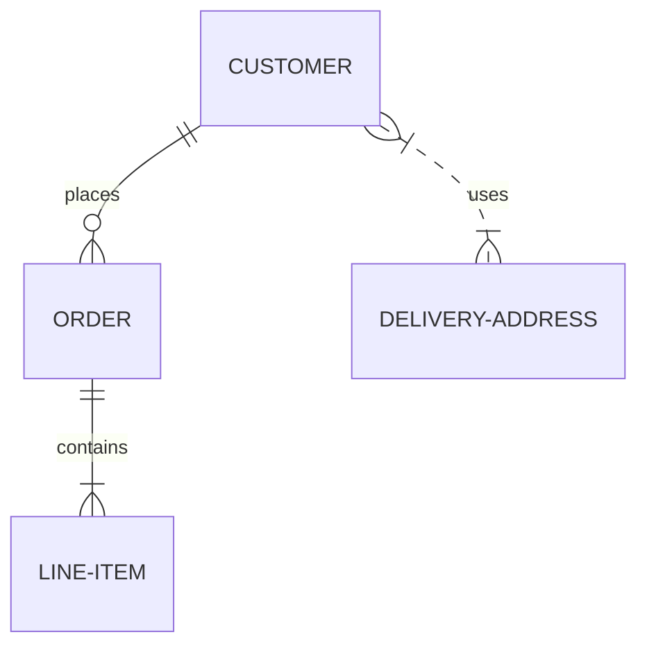

# Tjanstformedlingssida-FE
Frontend


## Userstory-012

### ER diagram

To create an ER write the code below in vim:

\```mermaid 
erDiagram
    CUSTOMER ||--o{ ORDER : places
    ORDER ||--|{ LINE-ITEM : contains
    CUSTOMER }|..|{ DELIVERY-ADDRESS : uses
\```

The code will return this:




