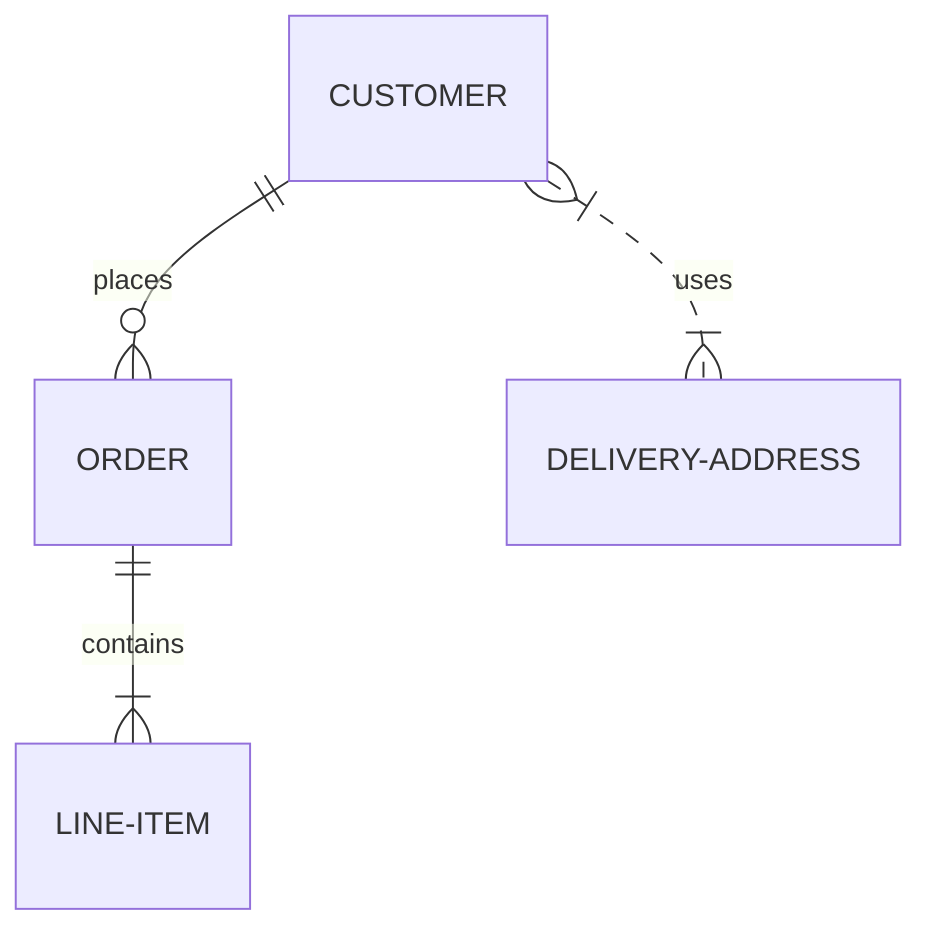

<h2>Testing testing</h2>
Testing testing

<h2>Userstory-015</h2>
To highlight certain words in Markdown use the &ltmark&gt tag like this:</br>
<mark>&ltmark&gtSome text&lt/mark&gt</mark></br>
(warning doesn't display in GitHub)


## Userstory-012

### ER diagram

To create an ER write the code below in vim:

\```mermaid 
erDiagram
    CUSTOMER ||--o{ ORDER : places
    ORDER ||--|{ LINE-ITEM : contains
    CUSTOMER }|..|{ DELIVERY-ADDRESS : uses
\```

The code will return this:



<h2>Userstory009</h2>

This is a horisontal ruler:
<hr />

<h2>Userstory002</h2>

Java code block:

``` java
public class MyClass {
public static void main(String[] args){
}
}
```

<h2>Userstory001</h2>

Javascript code block:

```javascript
let a = "hello"
```
<h2>useratory008<h2>

this is how you add a emoticon in Vim
:boom: :boom: :boom: :boom:
